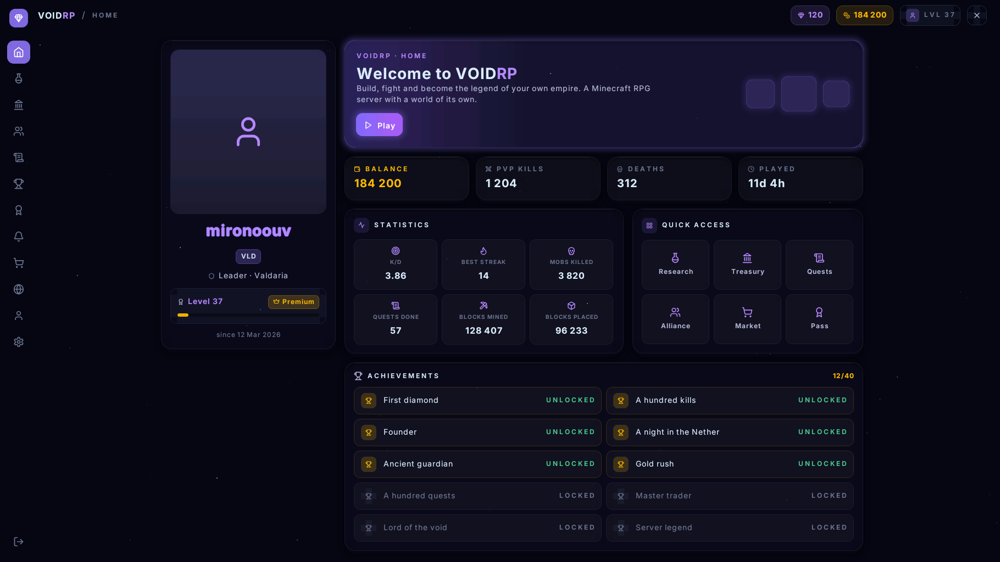

# VoidRP UI

[](https://github.com/VOIDRP-MINECRAFT/voidrp-ui/actions/workflows/ci.yml)

Настоящие интерфейсы на **ванильном клиенте Minecraft**. Без модов, без форджа, без
клиентских установок: игрок заходит обычным клиентом, принимает ресурспак — и видит окна
со скруглениями, прозрачностью, шрифтом Inter, иконками предметов и курсором, который
слушается мыши.

Плагин под Paper 26.2. Открытый код, лицензия MIT.

Клиенты 1.21.6–26.1.2 тоже обслуживаются: в 26.2 шейдер текста переименовали, а пак
называет свои файлы прямо, поэтому одним архивом обе версии не накрыть. Плагин собирает
два пака и выдаёт каждому игроку свой.



Это не мокап: страница выше нарисована тем же кодом, который отправляет её игроку —
каждый прямоугольник, буква и иконка здесь едут одной строкой текста в невидимом
босс-баре. Снимок делается командой `./gradlew preview`, без запуска игры.

## Зачем

В Minecraft интерфейс сервера — это сундук с предметами. Всё, что сложнее, требует мода на
клиенте, а мод ставят единицы. Платные решения вроде LocoUI рисуют интерфейс на ванильном
клиенте, но страницы в них собирают мышкой в редакторе и запекают в ресурспак: данные,
которых не было на момент сборки, показать нечем.

Здесь страница — это **код**, а всё содержимое едет с сервера в момент показа. Никакой
пересборки пака ради новой кнопки.

## Документация

| | |
|---|---|
| [Вёрстка](docs/вёрстка.md) | панели, размеры, сетки, прокрутка, области — из чего собирается страница |
| [Страница](docs/страница.md) | состояние, события, переходы, подсказки, ввод текста, API для своего плагина |
| [Готовые элементы](docs/компоненты.md) | кнопки, вкладки, переключатели, плитки, сообщения, диалоги — и как написать свой |
| [Адаптивность](docs/адаптивность.md) | холст под экран игрока, брейкпоинты, безопасная полоса, настройка формата |

## Установка

1. Положите `voidrp-ui.jar` в `plugins/` и перезапустите сервер.
2. Всё.

Плагин собирает ресурспак сам и сам же его раздаёт: поднимает маленький HTTP-сервер (порт
`8123` по умолчанию) и даёт игроку ссылку на тот адрес, который игрок ввёл при подключении.
Если порт закрыт фаерволом или сервер стоит за прокси — выложите
`plugins/VoidRpUI/voidrp-ui.zip` куда угодно и укажите `pack.url` в конфиге.

## Страница за пятнадцать строк

```kotlin
class ShopPage(private val balance: Int) : Page() {

    override fun view(): View = Panel(
        style = Theme.page,
        width = Size.Fixed(600),
        gap = Theme.SPACE_4,
        children = listOf(
            Text("Магазин", Theme.TEXT_H2, Theme.INK, Weight.SEMIBOLD),
            Text("На счету: $balance", Theme.TEXT_BODY, Theme.INK_SOFT),
            Panel(
                direction = Direction.ROW,
                gap = Theme.SPACE_3,
                align = Align.CENTER,
                children = listOf(Image("diamond", 32), Text("Алмаз — 100")),
            ),
            button("Купить", id = "buy"),
        ),
    )

    override fun onClick(id: String, button: Button) {
        if (id == "buy") { /* ... */ refresh() }
    }
}

plugin.pages.open(player, ShopPage(balance))
```

Страница — функция своего состояния: поменяли поле, позвали `refresh()`, и нарисовалось
новое. Никакого ручного обновления элементов.

## Подключение из своего плагина

Интерфейс зарегистрирован сервисом Bukkit, так что приводить ничего ни к каким классам не
надо и перезагрузка плагина под вами ничего не ломает.

```kotlin
val ui = VoidRpUi.get() ?: return   // плагин не установлен — теряются экраны, а не ваш плагин
ui.open(player, MyShopPage())
```

В `plugin.yml` — мягкая зависимость, чтобы ваш плагин работал и без интерфейсов:

```yaml
softdepend: [VoidRpUI]
```

Сборка через [JitPack](https://jitpack.io):

```kotlin
repositories { maven("https://jitpack.io") }

dependencies {
    compileOnly("com.github.VOIDRP-MINECRAFT:voidrp-ui:main-SNAPSHOT")
}
```

Jar собирается под **Java 21**, хотя компилируется против API Paper 26.2, — чтобы он
загружался и на сервере 1.21.6, который обычно работает на 21-й.

## Что есть

| | |
|---|---|
| **Раскладка** | строки и колонки, `gap`, выравнивание по обеим осям, `Size.Auto / Fill / Fixed / Percent`, сетка, прокрутка с ползунком |
| **Стили** | фон, прозрачность (16 ступеней), скругления, рамки, отступы, мягкие тени и свечения, блик по верхней кромке — всё через токены темы |
| **Текст** | Inter семи кеглей в трёх начертаниях, перенос по ширине с многоточием, выравнивание, разрядка, разноцветные куски внутри одной строки, свечение под буквами |
| **Головы** | лица игроков из скинов в `heads/` — запекаются в пак, список фиксирован |
| **Картинки** | свои PNG сервера — логотип, баннеры — из `images/`, в своих цветах и пропорциях |
| **Иконки** | 788 ванильных предметов и блоков — текстуры берутся из клиента, паку это ничего не стоит; плюс свой набор интерфейсных иконок |
| **Элементы** | кнопки, флажки, счётчики, выпадающие списки, ползунки, полосы прогресса, чипы, подсказки при наведении |
| **Ввод** | курсор из направления взгляда, наведение и клики (считаются на сервере), колесо мыши, цифры-горячие клавиши, перетаскивание ползунка, ввод текста через родные диалоги |
| **Холст** | 1024 единицы в высоту — вся высота окна при любом разрешении и масштабе; ширина по форме экрана, единица всегда квадратная |
| **Адаптивность** | страница верстается под экран игрока: брейкпоинты, `max-width` с автоцентрированием, безопасная полоса — см. [docs/адаптивность.md](docs/адаптивность.md) |

## Готовые элементы


Собирать кнопку из панели и текста каждый раз не надо — в `ru.voidrp.ui.widget` лежат
готовые, и все они живут по одному правилу: функция возвращает `View`, а нажатие приходит
в `onClick` с тем `id`, который вы задали.

```kotlin
button("Купить", id = "buy")                       // кнопка, три вида: основная, тихая, опасная
checkbox("Звуки", id = "sound", checked = sound)   // флажок
stepper("Количество", id = "qty", value = qty)     // − 5 +
select("Сложность", id = "diff", options, index)   // выпадающий список
slider("Громкость", id = "vol", value = 0.35)      // ползунок, тянется мышью
progress(0.7)                                       // полоса прогресса
chip("Новое")                                       // метка
```

Подсказка при наведении — это `tooltip()` у страницы: верните `View`, и он нарисуется у
курсора, пока игрок держит указатель на нужной области.

```kotlin
override fun tooltip(): View? =
    if (hovered == "buy") tooltipPanel("Алмаз", listOf("Цена: 100", "В наличии: 12")) else null
```

## Если на сервере есть PacketEvents

Плагин подхватит его сам и станет читать поворот игрока **прямо из пакета**, а не раз в
тик. Это снимает с курсора до 50 мс задержки — половину всей, что у него есть. Зависимость
мягкая: без PacketEvents всё работает, просто чуть менее отзывчиво. В логе при старте
написано, какой из двух путей выбран.

Ещё он подсказывает **версию клиента**, по которой выбирается пак: до 26.2 шейдер текста
назывался иначе. Без PacketEvents версия неизвестна, и плагин сначала пробует новый пак —
клиент, который не смог его применить, сам об этом сообщает, и ему тут же уходит старый.
Игрок в худшем случае видит вторую полоску загрузки.

## Две версии клиента

| Клиент | Что уезжает |
|---|---|
| 26.2 и новее | `voidrp-ui.zip` — шейдер `text.vsh` |
| 1.21.6 – 26.1.2 | `voidrp-ui-legacy.zip` — шейдер `rendertype_text.vsh` |

Пак для старых клиентов отличается ровно одним файлом — вершинным шейдером под старым
именем. Фрагментного в нём нет: патченный у нас есть только под 26.2, а без него клиент
выбрасывает всё слабее 0.1 прозрачности. Поэтому самый слабый уровень палитры у нас и так
1/8 — на обеих версиях рисуется одно и то же.

Оба собираются при старте, отдаются со встроенного сервера и настройки не требуют. Если
второй не нужен (все на одной версии) — `pack.legacy: false`, это секунда старта и лишний
мегабайт на диске. Если архивы вы выкладываете сами, адрес второго — `pack.legacy-url`.

## Адаптивность

Холст — 1024 единицы в высоту (вся высота окна) и столько единиц в ширину, сколько их
помещается при квадратной единице: 1280 на 5:4, 1820 на 16:9, 2389 на 21:9. Ничего не
сплющивается, страница верстается под ширину экрана.

```kotlin
Panel(
    width = Size.Fill, maxWidth = 1278,                 // как max-width + margin: 0 auto
    children = listOf(Grid(columns = viewport.by(compact = 2, regular = 3), children = tiles)),
)
```

Форму экрана игра серверу не сообщает — такого пакета нет. Поэтому игрок задаёт её сам
командой `/vui screen`: открывается рамка по краям холста, он жмёт форматы, пока она не
сядет по краям экрана. Выбор запоминается навсегда; до него берётся `display.screen` из
конфига. Ошибка в формате стоит только украшений — важное держится в безопасной полосе 4:3.

Подробно: **[docs/адаптивность.md](docs/адаптивность.md)**.

## Свои картинки

Положите PNG в `plugins/VoidRpUI/images/` — и страница нарисует их по имени файла:

```kotlin
Picture("logo", height = 64)   // images/logo.png
```

Высота задаётся, ширина берётся из пропорций самой картинки, так что широкий баннер
останется широким. В отличие от иконок интерфейса картинка идёт в своих цветах — за этим
логотип и нужен. Пак пересобирается при перезагрузке плагина, и игроки скачают его заново.

## Головы игроков

Положите скин в `plugins/VoidRpUI/heads/<ник>.png` — и страница нарисует лицо:

```kotlin
Head("mironoouv", size = 128)
```

Берётся квадрат 8×8 из скина вместе со слоем шапки, подходит и старый формат 64×32, и
современный 64×64.

**Откуда берутся скины.** Никуда наружу плагин не ходит: скин уже есть у самого игрока.
Каждый несёт на профиле подписанное свойство `textures` с адресом своего скина — у Mojang
на онлайн-сервере, у вашего скин-плагина на любом другом, — и читается именно он. Поэтому
это работает и на сервере со своими скинами, и не зависит от сторонних сервисов.

При входе игрока плагин сохраняет его скин в `heads/` (выключается через
`heads.collect: false`), а положить файл туда руками можно всегда — имя файла и есть ник.

Честное ограничение: голова должна быть в паке **до** того, как страница её попросит, а пак
собирается при старте плагина. То есть это для списка, который стоит на месте — команда
сервера, победители сезона, — а не для случайного игрока онлайн. На ванильном клиенте
иначе не выйдет: пак не умеет подтягивать картинки на лету.

## Настройка

Три файла в `plugins/VoidRpUI/`, все необязательные — что не указано, берётся из
умолчаний.

| Файл | Зачем |
|---|---|
| `config.yml` | откуда раздаётся пак, чувствительность курсора, звуки интерфейса, как страница ложится на окно |
| `theme.yml` | цвета, кегли, скругления, отступы — весь внешний вид под свой бренд |
| `messages.yml` | все строки, которые видит игрок; поддерживается MiniMessage |

Тема перечитывается вместе с конфигом, без перезапуска сервера.

**Наведение.** Подсветка того, на чём стоит курсор, рисуется на полосе самого курсора — это
несколько глифов с частотой кадров. Страница при этом не перерисовывается: она едет целиком
(около 13 КБ), и делать это на каждое пересечение карточки означало бы спотыкающийся курсор.
Поэтому стили наведения внутри страницы (`hovered == id`) по умолчанию не видны; странице,
которой они правда нужны, включите `input.redraw-on-hover: true`.

## Команды

| Команда | Кому | Что делает |
|---|---|---|
| `/vui open` | всем | открыть главную страницу |
| `/vui demo` | всем | демо со всеми элементами сразу |
| `/vui pack` | всем | прислать ресурспак ещё раз |
| `/vui close` | всем | закрыть страницу |
| `/vui screen` | всем | настроить формат экрана (рамка по краям + выбор в один клик) |
| `/vui debug …` | `voidrp.ui.debug` | замеры кодировщика, разбор раскладки, отладка курсора и нажатий |

## Рисовать страницу без игры

Сверстали страницу — посмотрите на неё, не заходя в Minecraft:

```kotlin
import ru.voidrp.ui.preview.Preview

Preview.render(MyPage(), File("my-page.png"))                         // 16:9
Preview.render(MyPage(), File("narrow.png"), Viewport.parse("4:3")!!) // и на узком экране
```

Рисует тот же движок, что отправляет страницу игроку: цвета квантуются в те же десять бит,
прозрачность в те же шестнадцать ступеней, буквы блитятся из тех же листов, что уезжают в
паке. Рядом с PNG кладётся `.txt` с точной геометрией — что где оказалось и какого размера.

Прямо из игры: **`/vui debug shot`** рисует ту страницу, которая сейчас открыта, в
`plugins/VoidRpUI/preview/`. Можно сразу в нескольких форматах: `/vui debug shot 4:3 16:9 21:9`.

Единственное, чего у сервера нет, — текстуры предметов: они живут в клиенте и в пак не
попадают. Укажите `VOIDRP_CLIENT_JAR=~/.minecraft/versions/26.2/26.2.jar`, и они тоже
нарисуются.

## Тесты

```bash
./gradlew test
```

Главный инвариант всего проекта: сервер обязан предсказывать перо клиента **точно**. Строка
сводится к нулевой ширине, босс-бар центрирует её — ошибка в пару пикселей сдвигает всю
страницу на половину этой ошибки. Три худших бага были именно этим, в трёх разных обличьях.

Поэтому тесты собирают настоящий пак, меряют чернила каждого глифа **по самим PNG** и
складывают строку по правилам клиента: прямоугольники всех размеров, текст всех кеглей,
иконки, курсор, целая страница, список при разных прокрутках. Расхождение — падение теста,
а не скриншот от игрока.

Отдельная проверка сверяет зашитые ширины иконок с текстурами клиента; ей нужен клиентский
jar, которого у нас нет права распространять:

```bash
VOIDRP_CLIENT_JAR=~/.minecraft/versions/26.2/26.2.jar ./gradlew test
```

Без переменной она пропускается.

Посмотреть на страницы, не заходя в игру, — тем же кодом, которым их увидит клиент:

```bash
./gradlew preview        # PNG со страницами в build/preview
```

## Сколько это стоит

```bash
./gradlew bench        # во что обходится отрисовка страницы
./gradlew packWeight   # сколько весит пак
```

| | |
|---|---|
| Страница | 3 мс на раскладку и кодирование, ~90 КБ в пакете — только когда что-то изменилось |
| Кадр курсора | 0.02 мс и несколько десятков байт, 62 раза в секунду — сотни игроков на ядро |
| Пак | 1.2 МБ, скачивается один раз при первом входе |

Страница едет заново только тогда, когда сама изменилась: наведение рисуется на полосе
курсора и страницу не трогает.

## Как это устроено

Коротко — потому что приём неочевидный.

Страница едет игроку как **одна строка текста в заголовке невидимого босс-бара**. В
ресурспаке лежит подменённый шейдер текста, который узнаёт наши символы по цвету и ставит
их куда надо:

- **по горизонтали** элемент ставит сам клиент — в шрифте есть невидимые символы-распорки
  шириной ±1…±512, ими двигают перо до пикселя;
- **по вертикали и цвет заливки** едут в цвете символа: 4 бита метки, 10 бит высоты,
  10 бит цвета (RGB 3-4-3);
- **форму рисует клиент**: в шрифте запечены прямоугольники со сторонами степеней двойки и
  скруглённые уголки, любая панель — это несколько таких кусков;
- **прозрачность** передать негде (в компоненте текста нет альфы), поэтому алфавит запечён
  16 раз, по шрифту на ступень, и кодировщик просто выбирает шрифт.

Строка сводится к нулевой ширине, чтобы центрирование босс-бара не сдвигало страницу.
Курсор — это направление взгляда игрока, пересчитанное в координаты холста; наведение и
клики проверяются на сервере по готовой раскладке, так что клиенту доверять не нужно.

Подробности и грабли — в [docs/internals.md](docs/internals.md).

## Ограничения, о которых честно

- Клиент сообщает направление взгляда **20 раз в секунду**; чаще узнать, куда смотрит
  игрок, нельзя. Курсор дорисовывается между тиками со сглаживанием, но входные данные
  приходят с этой частотой.
- Пока страница открыта, **голова игрока действительно поворачивается** — вернуть её силой
  можно только пакетом, а клиент тут же пришлёт свой, и экран затрясёт. Поэтому у модальных
  страниц фон делают непрозрачным: за ним поворота не видно.
- Цвет едет в десяти битах — RGB 3-4-3, — и в тёмной части шкалы шаг крупнее самих
  оттенков: `#060711` и `#090b16` садятся на одну запись, то есть фон страницы и карточка
  становятся неразличимы. Поэтому цвет выбирается **вместе с прозрачностью**: что видит
  глаз — это их смесь с тем, что лежит ниже. Скажите, что под вами, и вы получите ровно
  тот цвет, который назвали:

  ```kotlin
  Style(background = Palette.express(0x090B16, over = 0x060711))
  ```

- **Градиент** по той же причине: назвать оттенки в лоб — между фиолетовым и фоном их
  найдётся три-четыре, и заливка выйдет плитами. Укажите `over`, и каждая полоса
  подбирается поверх подложки — вдоль той же линии оттенков становится около сорока, шаг
  падает до одной-двух единиц:

  ```kotlin
  Gradient(Paint(0x32295F), Paint(0x16112C), over = Theme.BG, stop = 0.45)
  ```

  Без `over` градиент по-прежнему полосит — это не небрежность, а предел носителя.
- Форму экрана игрока сервер **узнать не может** — ванильный клиент её не отправляет, и
  пакета, которым её спросить, не существует. Поэтому её задаёт сам игрок (`/vui screen`,
  один раз), а до этого берётся серверное значение. Искажений при этом нет никогда:
  единица квадратная, а неверный формат стоит только полей по краям или обрезанных
  украшений — важное держится в безопасной полосе 4:3.
- Страница едет в **босс-баре**, а бары складываются стопкой в том порядке, в каком их
  получил клиент. Если к моменту открытия страницы игроку уже показывает свой бар другой
  плагин, наш окажется вторым — и вся страница уедет на 19 единиц вниз. Свои забытые бары
  плагин убирает сам при открытии; чужие убрать нельзя, и узнать о них тоже: сервер не
  видит, что у клиента на экране. На сервере с постоянным баром (TPS, ивенты) такой бар
  стоит гасить на время открытой страницы.
- Клиентские шейдерпаки (Iris, OptiFine) заменяют рендер мира, но интерфейс оставляют
  ванильным, так что страницы переживают их. Моды, которые сами лезут в шейдеры текста, —
  нет.

## Лицензия

MIT — делайте что хотите, в том числе на коммерческих серверах.

Внутри лежит шрифт [Inter](https://rsms.me/inter/) под SIL Open Font License (текст лицензии
в jar, `font/Inter-OFL.txt`). Текстуры предметов не входят в пак — они берутся из клиента.

Сделано для [void-rp.ru](https://void-rp.ru). Если пригодилось — упоминание не обязательно,
но приятно.

---

## English

Real interfaces on a **vanilla Minecraft client** — no mods, nothing to install. A page is
written in code and rendered by the client itself: rounded panels, opacity, the Inter
typeface, item icons and a cursor driven by where the player is looking.

A page travels as one line of text in an invisible boss bar's title. A replaced text shader
recognises our glyphs by their colour and moves them: horizontal position is done by the
client through invisible spacer glyphs, vertical position and fill colour ride in the
glyph's colour, shapes are power-of-two rectangles and rounded corners baked into the font,
and opacity is a choice of font because a text component has no alpha to carry it.

Hovering and clicks are resolved on the server against the layout it just produced, so the
client is never trusted and never asked.

Paper 1.21.6+, Kotlin, MIT.
