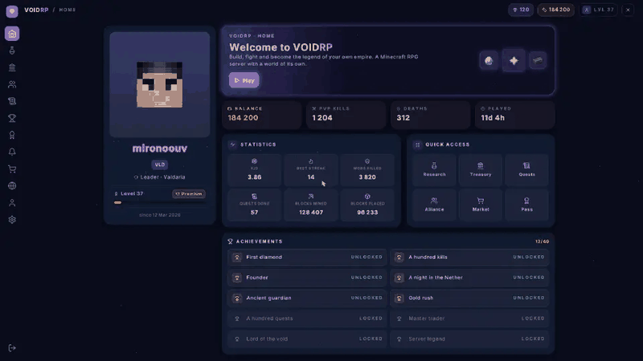
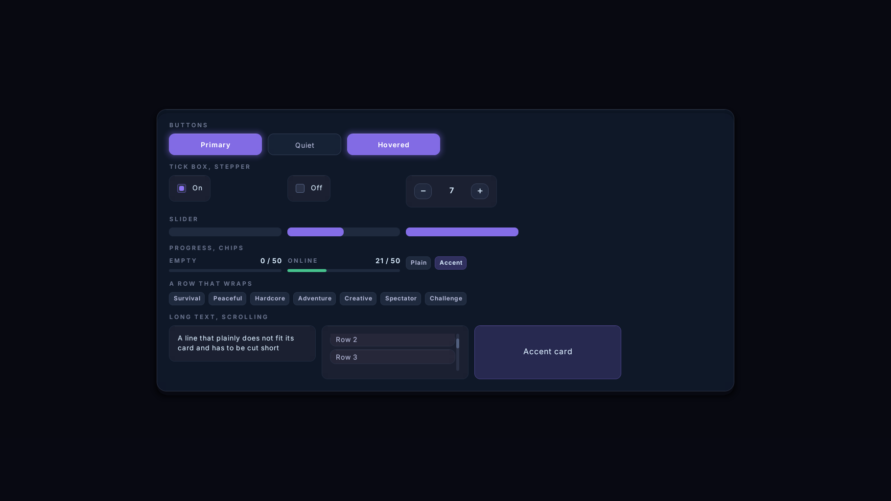
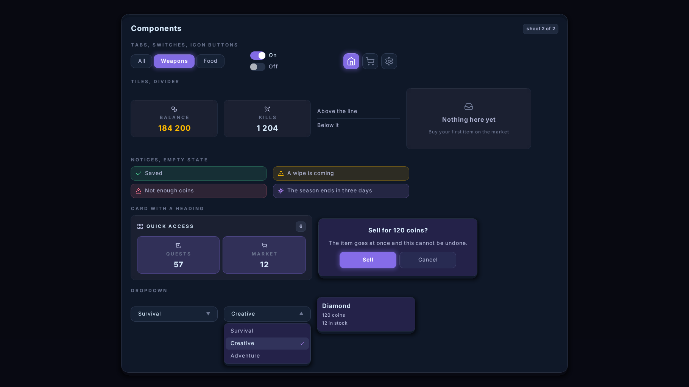
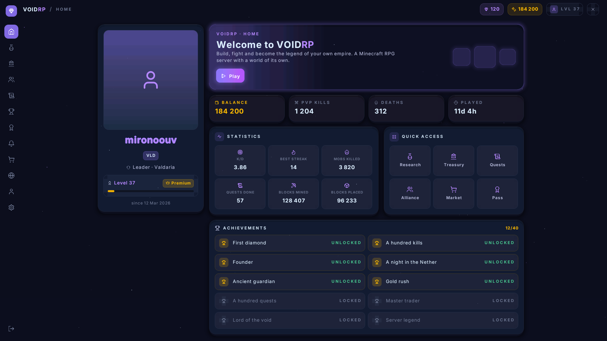
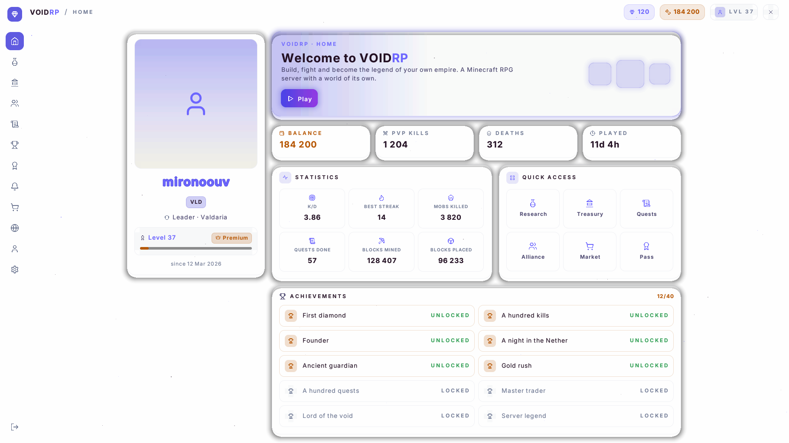
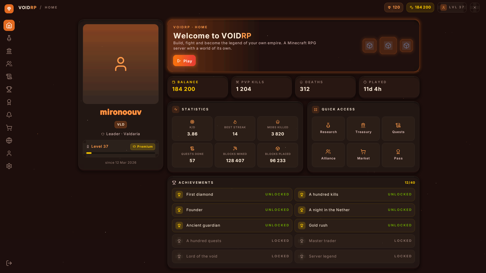
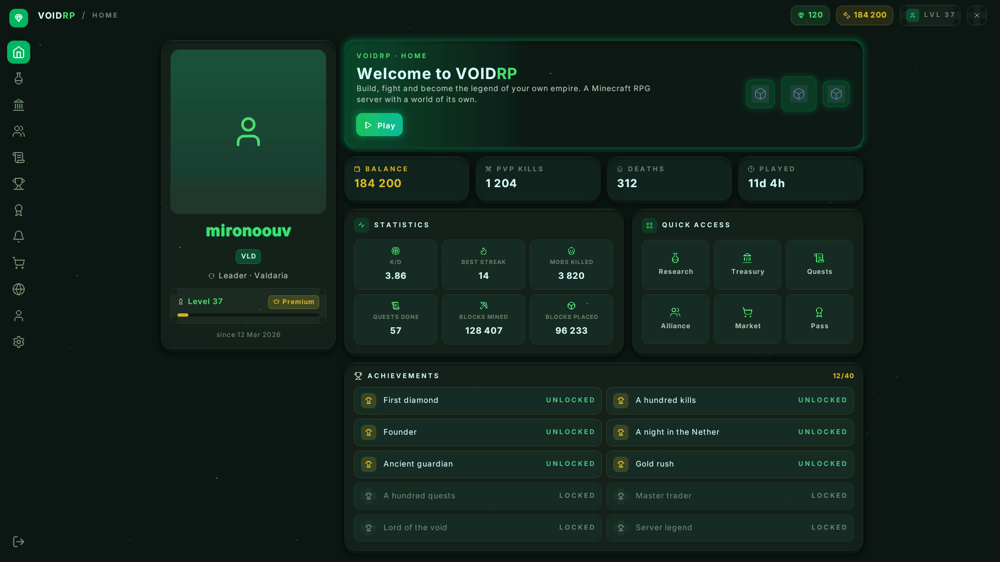

# VoidRP UI

[](https://github.com/VOIDRP-MINECRAFT/voidrp-ui/actions/workflows/ci.yml)
[](https://github.com/VOIDRP-MINECRAFT/voidrp-ui/releases/latest)
[](LICENSE)
[](https://modrinth.com/plugin/voidrp-ui)
[](https://hangar.papermc.io/mironoouv/VoidRP-UI)
[](https://www.spigotmc.org/resources/voidrp-ui.139079/)

Real interfaces on a **vanilla Minecraft client**. No mods, no Forge, nothing for the
player to install: they join with the client they already have, accept the server's
resource pack, and see panels with rounded corners, opacity, the Inter typeface, item
icons and a cursor that answers the mouse.

A Paper plugin, MIT licensed.

Clients from 1.21.6 to 26.1.2 are served too. Mojang renamed the text shader in 26.2 and a
pack names its files outright, so one archive cannot cover both versions — the plugin
builds two packs and hands each player the one their client can read.


That is a screenshot, not a mock-up and not a render: a vanilla client, the player's own
skin, the game's own item textures, and the cursor sitting on the tile it is hovering.
Every rectangle, letter and icon in it travels as one line of text in an invisible boss
bar. The pictures further down are drawn with `./gradlew preview`, which puts the same
pages on disk without starting the game.



The same page, recorded as it is used: the player turns their head, the cursor follows, and
whatever it is over lights up. Recorded at real speed on a test client with no graphics
card, which draws about twenty-five frames a second — a player's own client draws the
pointer at whatever rate their screen runs.

## Why

A server interface in Minecraft is a chest full of items. Anything richer needs a client
mod, and hardly anyone installs one. Paid products like LocoUI do draw interfaces on a
vanilla client, but their pages are assembled by mouse in an editor and baked into a
resource pack: data that did not exist when the pack was built cannot be shown.

Here a page is **code**, and everything in it travels from the server at the moment it is
shown. No repacking to add a button.

## Documentation

| | |
|---|---|
| [Layout](docs/layout.md) | panels, sizes, grids, scrolling, regions — what a page is built from |
| [Pages](docs/page.md) | state, events, navigation, tooltips, text input, the API for your own plugin |
| [Components](docs/components.md) | buttons, tabs, switches, tiles, notices, dialogs — and how to write your own |
| [Theming](docs/theming.md) | four themes in the jar, every token, and how to write your own |
| [Responsive](docs/responsive.md) | a canvas shaped like the player's screen, breakpoints, the safe band, screen setup |
| [Example plugin](example/) | the working minimum: a command, a page, one dependency — copy the folder and build it |
| [Internals](docs/internals.md) | how the trick works, and every rake it stepped on |
| [Changelog](CHANGELOG.md) | versions, and what arrived in them |

## Installing

1. Download the jar from [Modrinth](https://modrinth.com/plugin/voidrp-ui),
   [Hangar](https://hangar.papermc.io/mironoouv/VoidRP-UI),
   [SpigotMC](https://www.spigotmc.org/resources/voidrp-ui.139079/) or
   [releases](https://github.com/VOIDRP-MINECRAFT/voidrp-ui/releases/latest) — it is the same
   file everywhere. It needs **Paper**; it does not run on Spigot itself.
2. Drop it into `plugins/` and restart the server.
3. That is all.

Worth adding, but not needed: [PacketEvents](https://modrinth.com/plugin/packetevents). With
it the cursor answers up to 50 ms sooner, a player on an older client is handed the right
pack straight away, and other plugins' boss bars stay off a page while it is open. See
[below](#if-the-server-has-packetevents).

The first page a player opens starts with screen setup — a frame on the edge of the canvas
that they line up with their own monitor. Five seconds, once in their life; why it is
needed at all is in [responsive](docs/responsive.md), and it is turned off with
`display.ask-screen: false`.

The plugin builds the resource pack itself and serves it itself: a small HTTP server (port
`8123` by default) hands each player a link to the address they typed to get here. If the
port is closed or the server sits behind a proxy, put `plugins/VoidRpUI/voidrp-ui.zip`
anywhere you like and set `pack.url` in the config.

## A page in fifteen lines

```kotlin
class ShopPage(private val balance: Int) : Page() {

    override fun view(): View = Panel(
        style = Theme.page,
        width = Size.Fixed(600),
        gap = Theme.SPACE_4,
        children = listOf(
            Text("Shop", Theme.TEXT_H2, Theme.INK, Weight.SEMIBOLD),
            Text("Balance: $balance", Theme.TEXT_BODY, Theme.INK_SOFT),
            Panel(
                direction = Direction.ROW,
                gap = Theme.SPACE_3,
                align = Align.CENTER,
                children = listOf(Image("diamond", 32), Text("Diamond — 100")),
            ),
            button("Buy", id = "buy"),
        ),
    )

    override fun onClick(id: String, button: Button) {
        if (id == "buy") { /* ... */ refresh() }
    }
}

plugin.pages.open(player, ShopPage(balance))
```

A page is a function of its own state: change a field, call `refresh()`, and the new page
is drawn. Nothing is updated element by element.

## From your own plugin

The interface is registered as a Bukkit service, so nothing has to be cast to anything and
reloading the plugin underneath you breaks nothing.

```kotlin
val ui = VoidRpUi.get() ?: return   // not installed: you lose screens, not your plugin
ui.open(player, MyShopPage())
```

A soft dependency in `plugin.yml`, so your plugin still runs without interfaces:

```yaml
softdepend: [VoidRpUI]
```

Building against it through [JitPack](https://jitpack.io):

```kotlin
repositories { maven("https://jitpack.io") }

dependencies {
    compileOnly("com.github.VOIDRP-MINECRAFT:voidrp-ui:v0.3.12")
}
```

The version is the release tag, `v` included — that is how JitPack names it. `main-SNAPSHOT`
follows the latest commit instead. [`example/`](example/) is a whole plugin built this way,
with its own Gradle wrapper, so it builds wherever it is copied to.

The jar targets **Java 21** even though it compiles against the Paper 26.2 API, so that it
loads on a 1.21.6 server, which usually runs on 21.

## What there is

| | |
|---|---|
| **Layout** | rows and columns, `gap`, alignment on both axes, `Size.Auto / Fill / Fixed / Percent`, grids, scrolling with a bar |
| **Style** | background, opacity (16 steps), rounding, borders, padding, soft shadows and glows, a lit top edge — all through theme tokens |
| **Text** | Inter at seven sizes in three weights, wrapping with an ellipsis, alignment, tracking, differently coloured runs inside one line, a glow behind the letters |
| **Heads** | players' faces from the skins in `heads/` — baked into the pack, so the list is fixed |
| **Pictures** | the server's own PNGs — a logo, a banner — from `images/`, in their own colours and proportions |
| **Icons** | 788 vanilla items and blocks, with the textures read from the client so the pack pays nothing for them, plus a set of interface icons |
| **Components** | buttons, tick boxes, steppers, dropdowns, sliders, progress bars, chips, tooltips |
| **Input** | a cursor driven by where the player looks, hovering and clicks resolved on the server, the scroll wheel, number keys, dragging a slider, text typed into the game's own field |
| **Canvas** | 1024 units tall — the whole height of the window at any resolution and GUI scale; as wide as the shape of the screen, with a unit that is always square |
| **Responsive** | a page is laid out for the player's screen: breakpoints, `max-width` with automatic centring, a safe band — see [docs/responsive.md](docs/responsive.md) |

## Components




There is no need to build a button out of a panel and a label every time —
`ru.voidrp.ui.widget` has them, and they all follow one rule: a function returns a `View`,
and pressing it arrives in `onClick` with the `id` you gave it.

```kotlin
button("Buy", id = "buy")                          // three kinds: primary, quiet, dangerous
checkbox("Sounds", id = "sound", checked = sound)  // tick box
stepper("Amount", id = "qty", value = qty)         // − 5 +
select("Difficulty", id = "diff", options, index)  // dropdown
slider("Volume", id = "vol", value = 0.35)         // slider, draggable
progress(0.7)                                       // progress bar
chip("New")                                         // label
```

A tooltip is the page's `tooltip()`: return a `View` and it appears the moment the player
points at the region. It goes under a row or a tile rather than beside the cursor, so it
never covers what it describes, and follows the cursor across anything taller.

```kotlin
override fun tooltip(): View? =
    if (hovered == "buy") tooltipPanel("Diamond", listOf("Price: 100", "In stock: 12")) else null
```

## If the server has PacketEvents

The plugin picks it up by itself and starts reading the player's aim **straight off the
packet** instead of once a tick. That takes up to 50 ms off the cursor — about half of all
the lag it has. The dependency is soft: without PacketEvents everything works, just a
little less immediately. The log says at startup which of the two paths was taken.

It also tells us the **client's version**, which decides the pack: before 26.2 the text
shader had a different name. Without PacketEvents the version is unknown, so the modern
pack is tried first — a client that cannot apply it says so, and the older one follows at
once. The worst a player sees is a second loading bar.

And it lets the plugin **keep other plugins' boss bars off a page**. A page rides a boss
bar, so an event timer or a TPS meter would otherwise sit on top of the page or push it
down. While a page is open those bars are held back, the way the game's own menus cover the
HUD, and when it closes they come back as they are by then.

## Two client versions

| Client | What it gets |
|---|---|
| 26.2 and newer | `voidrp-ui.zip` — the `text.vsh` shader |
| 1.21.6 – 26.1.2 | `voidrp-ui-legacy.zip` — the `rendertype_text.vsh` shader |

The pack for older clients differs in two ways. The vertex shader goes under its old name,
and there is no fragment shader, because the patched one only exists for 26.2 and without
it a client throws away anything under a tenth of opacity. That is why the faintest level
of the palette is an eighth anyway. And its item pictures leave out the 193 textures that
1.21.6 does not have: a client asked for a file it has never heard of drops the whole icon
font, so each of those becomes a space of the same width and the page does not move.

Both are tried on real clients, 26.2 and 1.21.6 through ViaVersion, and draw the same page.

Both are built at startup, served from the built-in server, and need no configuration. If
the second one is not needed because everybody is on one version, `pack.legacy: false`
saves a second of startup and a megabyte of disk. If you host the archives yourself, the
second address is `pack.legacy-url`.

## Four looks, one page

| | |
|---|---|
|  |  |
| **midnight** — near-black with violet, the default | **daylight** — a light theme |
|  |  |
| **ember** — warm dark | **grove** — dark green |

The same page and the same code: the whole look is a dozen colours in `theme.yml`, and the
jar carries these four to start from. See [theming](docs/theming.md).

## Responsive

The canvas is 1024 units tall — the whole height of the window — and as many units across
as fit while a unit stays square: 1280 on 5:4, 1820 on 16:9, 2389 on 21:9. Nothing is ever
squashed; the page is laid out for the width of the screen.

```kotlin
Panel(
    width = Size.Fill, maxWidth = 1278,                 // max-width plus margin: 0 auto
    children = listOf(Grid(columns = viewport.by(compact = 2, regular = 3), children = tiles)),
)
```

The game never tells the server what shape the window is — there is no such packet. So the
player says, once, on the screen setup page: a frame on the edge of the canvas, and they
pick until it sits on the edges of their screen. The answer is remembered for good; until
then `display.screen` from the config is assumed. Getting it wrong costs decoration only —
everything that matters stays inside the 4:3 safe band.

In full: **[docs/responsive.md](docs/responsive.md)**.

## Your own pictures

Drop a PNG into `plugins/VoidRpUI/images/` and a page can draw it by the name of the file:

```kotlin
Picture("logo", height = 64)   // images/logo.png
```

You give the height; the width follows the picture's own proportions, so a wide banner
stays wide. Unlike an interface icon, a picture keeps its own colours — which is what a
logo is for. The pack is rebuilt when the plugin reloads, and players download it again.

## Players' faces

Put a skin at `plugins/VoidRpUI/heads/<name>.png` and a page can draw the face:

```kotlin
Head("mironoouv", size = 128)
```

The 8×8 square is taken from the skin together with the hat layer; both the old 64×32
format and the modern 64×64 one work.

**Where the skins come from.** The plugin never calls anything outside: the skin is already
on the player. Each one carries a signed `textures` property on their profile with the
address of their skin — Mojang's on an online-mode server, your skin plugin's on any
other — and that is what is read. So this works on a server with its own skins, and depends
on no third-party service.

When a player joins, their skin is saved into `heads/` (turn it off with
`heads.collect: false`), and you can always drop a file in by hand — the file name is the
player's name.

An honest limit: a face has to be in the pack **before** a page asks for it, and the pack is
built when the plugin starts. So this is for a list that stays put — the server's staff, a
season's winners — not for whichever player happens to be online. On a vanilla client there
is no way around it: a pack cannot fetch pictures as it goes.

## Configuration

Three files in `plugins/VoidRpUI/`, all optional — anything unset comes from the defaults.

| File | What is in it |
|---|---|
| `config.yml` | where the pack is served from, how the cursor moves (sensitivity, smoothing, prediction, frame rate), interface sounds, the screen the pages are laid out for |
| `theme.yml` | colours, type sizes, rounding — the whole look, for your own brand ([four to start from](docs/theming.md)) |
| `messages.yml` | every string a player is shown; MiniMessage is supported |

`language: en` or `ru` in the config decides which set of words is written into
`messages.yml` on the first run. After that the file is yours and changing the setting will
not overwrite it. The theme is re-read along with the config, without restarting the server.

**Hovering.** The highlight under the cursor is drawn on the cursor's own boss bar — a few
glyphs at frame rate. The page itself is not redrawn: it travels whole (about 90 KB), and
doing that every time the cursor crosses a card would be felt as the cursor stuttering. So
hover styles inside a page (`hovered == id`) are not visible by default; a page that really
needs them turns on `input.redraw-on-hover: true`.

## Commands

| Command | Who | What it does |
|---|---|---|
| `/vui open` | everyone | opens the home page |
| `/vui demo` | everyone | the demo, with every component at once |
| `/vui pack` | everyone | sends the resource pack again |
| `/vui close` | everyone | closes the page |
| `/vui screen` | everyone | screen setup: a frame on the edges, one click per shape |
| `/vui debug …` | `voidrp.ui.debug` | encoder measurements, layout dumps, cursor and click debugging |

## Drawing a page without the game

Laid a page out — look at it without starting Minecraft:

```kotlin
import ru.voidrp.ui.preview.Preview

Preview.render(MyPage(), File("my-page.png"))                         // 16:9
Preview.render(MyPage(), File("narrow.png"), Viewport.parse("4:3")!!) // and on a narrow screen
```

It is drawn by the same engine that sends a page to a player: colours quantised to the same
ten bits, opacity to the same sixteen steps, letters blitted out of the very sheets that
travel in the pack. A `.txt` with the exact geometry is written beside the PNG — what ended
up where, and how big.

From inside the game: **`/vui debug shot`** draws whatever page is open into
`plugins/VoidRpUI/preview/`, in as many shapes as you name:
`/vui debug shot 4:3 16:9 21:9`.

The one thing the server does not have is item textures: they live in the client and never
enter the pack. Point `VOIDRP_CLIENT_JAR=~/.minecraft/versions/26.2/26.2.jar` at a client
jar and those are drawn too.

## Tests

```bash
./gradlew test
```

The invariant the whole project rests on: the server must predict the client's pen
**exactly**. The line is brought back to zero width and the boss bar centres it, so an
error of a couple of pixels moves the whole page by half of it. The three worst bugs here
were that, in three different disguises.

So the tests build a real pack, measure the ink of every glyph **from the PNGs themselves**
and assemble the line by the client's own rules: rectangles of every size, text at every
size, icons, the cursor, a whole page, a list at every scroll offset. A disagreement is a
failing test rather than a screenshot from a player.

A separate check compares the baked icon widths against the client's textures; it needs a
client jar, which we have no right to distribute:

```bash
VOIDRP_CLIENT_JAR=~/.minecraft/versions/26.2/26.2.jar ./gradlew test
```

Without the variable it is skipped.

To look at the pages without joining the game, drawn by the code the client will run:

```bash
./gradlew preview        # PNGs of the pages in build/preview
```

Three environment variables make the drawing the real thing rather than placeholders:
`VOIDRP_CLIENT_JAR` points at a client jar and the item icons come out as the game's own
textures, `VOIDRP_HEADS` at a server's `plugins/VoidRpUI/heads` and the faces are real
players', `VOIDRP_IMAGES` at its `images` and the server's own pictures are drawn.

## What it costs

```bash
./gradlew bench        # what drawing a page costs
./gradlew packWeight   # what the pack weighs
```

| | |
|---|---|
| A page | 3 ms to lay out and encode, ~90 KB on the wire — only when something changed |
| A cursor frame | 0.02 ms and a few dozen bytes, 85 times a second — hundreds of players per core |
| The pack | 1.2 MB, downloaded once on the first join |

A page is sent again only when the page itself changed: hovering is drawn on the cursor's
bar and never touches it.

## How it works

Briefly, because the trick is not obvious.

A page travels to the player as **one line of text in the title of an invisible boss bar**.
The resource pack carries a replaced text shader that recognises our glyphs by their colour
and puts them where they belong:

- **horizontal position** is done by the client — the font has invisible spacer glyphs
  ±1…±512 wide, and the pen is moved with them to the pixel;
- **vertical position and fill colour** ride in the glyph's colour: a 4-bit marker, 10 bits
  of height, 10 bits of colour (RGB 3-4-3);
- **the shape is drawn by the client**: rectangles with power-of-two sides and rounded
  corners are baked into the font, and any panel is a few of those;
- **opacity** has nowhere to travel (a text component has no alpha), so the alphabet is
  baked sixteen times, one font per step, and the encoder simply picks a font.

The line is brought back to zero width so that the boss bar's centring does not move the
page. The cursor is the player's aim converted into canvas coordinates; hovering and clicks
are resolved on the server against the layout it just produced, so the client is never
trusted and never asked.

The details, and the rakes — in [docs/internals.md](docs/internals.md).

## Limits, honestly

- The client reports where it is looking **20 times a second**; there is no way to know
  more often. The cursor is interpolated between ticks, but that is the rate the input
  arrives at.
- While a page is open **the player's head really does turn** — forcing it back takes a
  packet, the client immediately sends its own, and the screen shakes. Which is why modal
  pages get an opaque background: behind it the turning is not visible.
- Colour travels in ten bits — RGB 3-4-3 — and at the dark end the step is bigger than the
  shades themselves: `#060711` and `#090b16` land on the same entry, so a page and a card
  on it become indistinguishable. So a colour is chosen **together with its opacity**: what
  the eye sees is their mix with whatever is underneath. Say what is underneath and you get
  exactly the colour you named:

  ```kotlin
  Style(background = Palette.express(0x090B16, over = 0x060711))
  ```

- **Gradients** for the same reason: name the shades outright and there are three or four
  of them between violet and the background, so the wash comes out in slabs. Give `over`
  and each stripe is chosen over that backdrop — about forty shades along the same line,
  with a step of one or two units:

  ```kotlin
  Gradient(Paint(0x32295F), Paint(0x16112C), over = Theme.BG, stop = 0.45)
  ```

  Without `over` a gradient still bands, and that is the limit of the medium rather than
  carelessness.
- The server **cannot know** the shape of the player's screen — a vanilla client does not
  send it and there is no packet to ask with. So the player sets it (`/vui screen`, once),
  and until they do the server's own setting is used. Nothing is ever distorted by this:
  the unit is square, and a wrong shape costs margins at the edges or clipped decoration —
  what matters stays inside the 4:3 safe band.
- A page rides a **boss bar**, and bars stack in the order the client received them.
  With PacketEvents installed, other plugins' bars are held back while a page is open and
  come back when it closes. Without it the server cannot see them at all: a bar another
  plugin is already showing puts the page 19 units down. A page itself takes four bars
  (three for the page, one for the pointer) — the most every client is sure to draw.
- Client shader packs (Iris, OptiFine) replace world rendering and leave the interface
  vanilla, so pages survive them. Mods that touch the text shaders themselves do not.

## Licence

MIT — do what you like, including on commercial servers.

It bundles the [Inter](https://rsms.me/inter/) typeface under the SIL Open Font License
(the licence text is in the jar, `font/Inter-OFL.txt`). Item textures are not in the pack —
they are read from the client.

Made for [void-rp.ru](https://void-rp.ru). A mention is not required, but it is nice.
